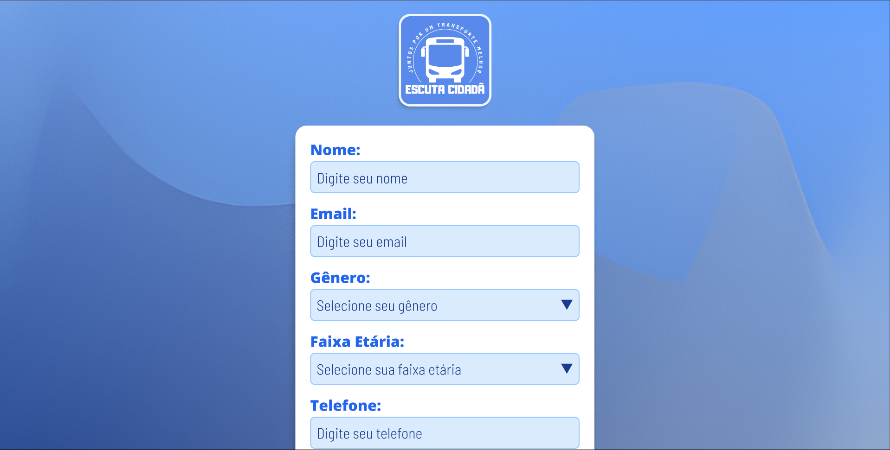
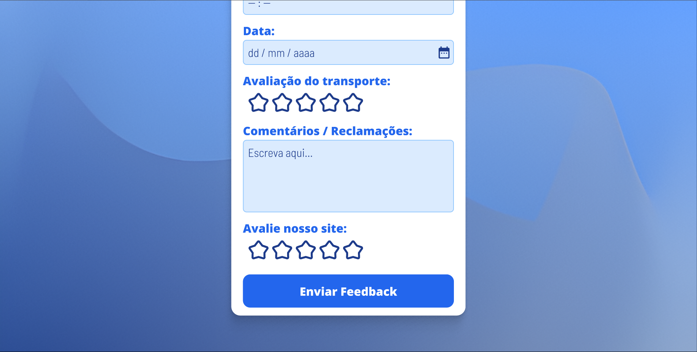
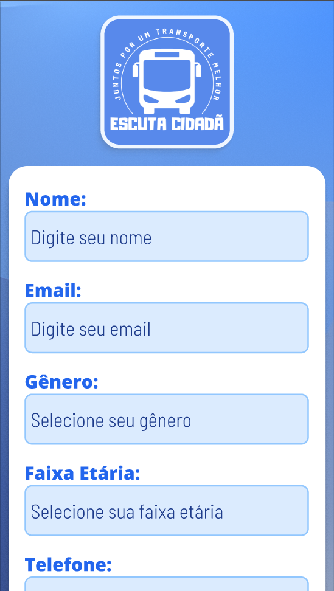
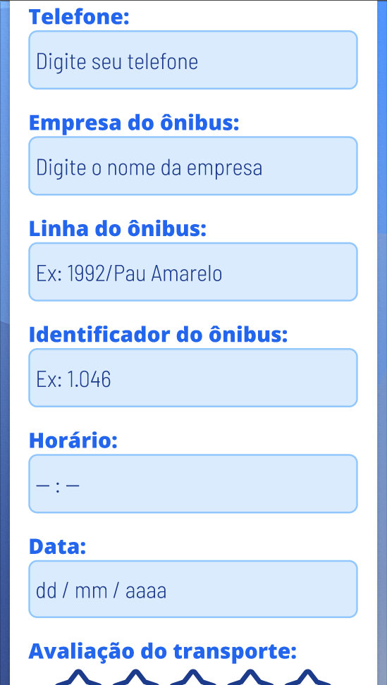
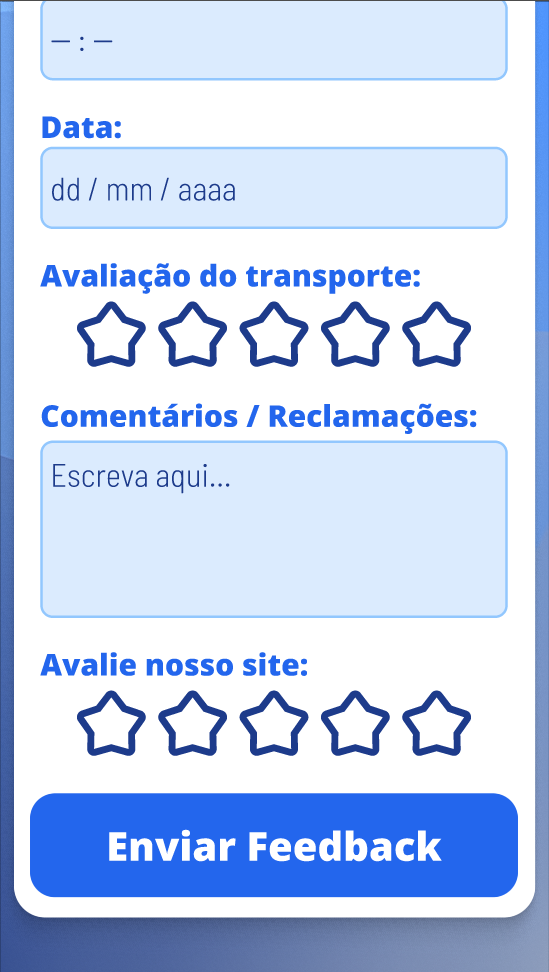
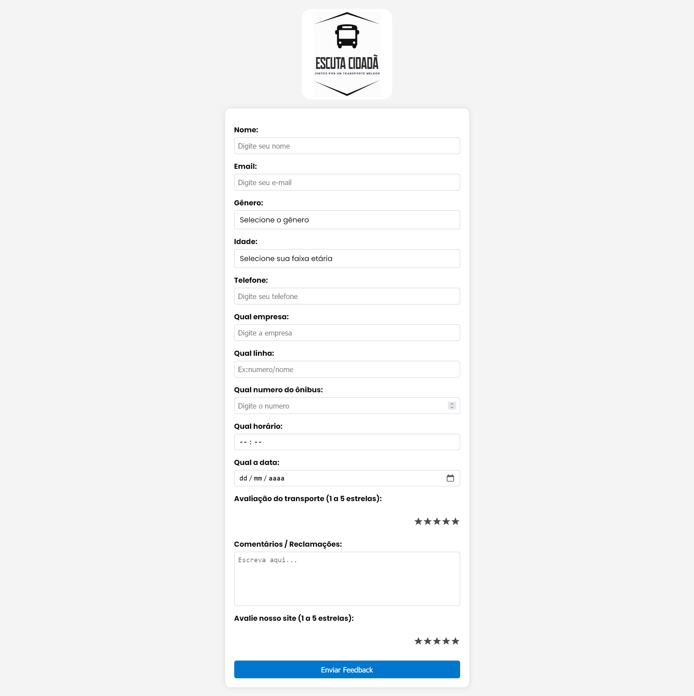

# Escuta Cidadã

> "Juntos por um transporte melhor"

---

Este repositório contém a conversão do front-end da aplicação **Escuta Cidadã**, responsável pela interface web/mobile, para uma **aplicação React**, que ainda será aplicada futuramente para o projeto principal com seu devido back-end e conexão com banco de dados.

## 🌟 Nosso Objetivo

O projeto **Escuta Cidadã** está sendo desenvolvido para facilitar a comunicação entre a população e os órgãos responsáveis, criando um canal direto para o registro de experiências, denúncias e sugestões relacionadas à mobilidade urbana. Além disso, a aplicação busca identificar e organizar os dados de forma estruturada e com maior agilidade.

Pensada para ser acessível, intuitiva e funcional, a plataforma atenderá diretamente os usuários do transporte público. Com essas informações, espera-se contribuir para que os órgãos responsáveis possam agir de forma mais eficiente na resolução de problemas e na melhoria do serviço.

## 🔧 Tecnologias Utilizadas

- **React**
- **JavaScript**
- **HTML5**
- **CSS**

## 🚀 O projeto já está hospedado e funcionando online!

Você pode acessar a **aplicação hospedada** (principal, sem React) diretamente pelo link abaixo, sem necessidade de instalação local:

🔗 [Acessar Escuta Cidadã](https://escuta-cidada.web.app/)

Além disso, você também pode conferir os **repositórios** utilizados na aplicação principal hospedada:

🔗 [Acessar o Repositório Principal do Front-End](https://github.com/GuilhermeAzevedo01/Escuta-Cidada)

🔗 [Acessar o Repositório Principal do Back-End](https://github.com/GuilhermeAzevedo01/Escuta-Cidada-Back)

---

## 💻 Como Rodar o Projeto Localmente

Para rodar o projeto **Escuta Cidadã** (React) no seu computador, siga os passos abaixo:

### 1. Instale os softwares necessários na sua máquina

#### 1.1. Node.JS e NPM

Para rodar a aplicação React localmente, é necessária a instalação do software Node.JS e o gerenciador de pacotes NPM. Para isso, você pode acessar o [site oficial do Node.JS](https://nodejs.org/pt), baixar a versão LTS (suporte estendido - Long Term Support) mais recente e realizar a instalação padrão normalmente — assim também instalando o NPM em conjunto, se a opção "npm package manager" continuar marcada na tela de "Custom Setup".

#### 1.2. Git

Caso ainda não tenha instalado, é possível instalar através do [site oficial do Git](https://git-scm.com/downloads) para realizar ações básicas, como clonar repositórios do GitHub.

### 2. Clone o repositório

Com tudo instalado, faça o "clone" do repositório para a sua máquina local usando o Git. Para isso, abra o terminal e execute o comando:

```console
git clone https://github.com/guilhermechroma/escuta-cidada-react.git
```

Isso criará uma cópia local do repositório no seu computador.

### 3. Navegue até o diretório do projeto

Após clonar o repositório, navegue até o diretório do projeto com o comando:

```console
cd escuta-cidada-react
```

### 4. Rode o projeto localmente

Agora, dentro do diretório, instale as dependências do projeto com o comando:

```console
npm install
```

Em seguida, rode localmente o projeto com esse último comando:

```console
npm run dev
```

Com tudo feito, no terminal, aparecerá um link de "localhost" para clicar com `Ctrl + Botão Esquerdo do Mouse` ou copiar e colar no seu navegador. Nessa página, poderá visualizar o projeto rodando em tempo real (sendo atualizado de acordo com as mudanças do projeto feitos na sua máquina, ainda precisando fazer um `git pull` caso haja alguma atualização no repositório remoto do GitHub)

## 🌀 Fluxo de Uso do Sistema

**1. Escanear o QR Code** - O usuário escaneia o QR Code, posicionado estrategicamente nas portas dos ônibus.

**2. Acesso ao formulário** - O QR Code redireciona para uma página hospedada no Firebase, onde está o formulário online.

**3. Preenchimento das informações** - O usuário preenche o formulário com informações sobre sua experiência no transporte público.

**4. Envio dos dados** - As informações são enviadas para o backend, desenvolvido em Django (Python).

**5. Processamento e armazenamento** - O backend valida e armazena os dados no banco de dados PostgreSQL, hospedado na Render.

**6. Acesso dos gestores** - Os dados ficam disponíveis para visualização através do painel administrativo do Django, acessado por gestores via link protegido.

## 🧑‍💻 Modo de Uso pelo Usuário

1. Escanear o QR Code disponibilizado nos transportes públicos

2. Acessar o formulário e preencher as informações necessárias

3. Enviar o formulário com os detalhes do relato

## ⚙️ Protótipos

### 🖥️ Web





### 📱 Mobile





## 💾 Estado atual do projeto


